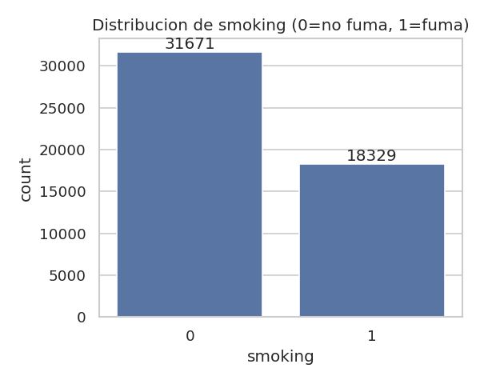
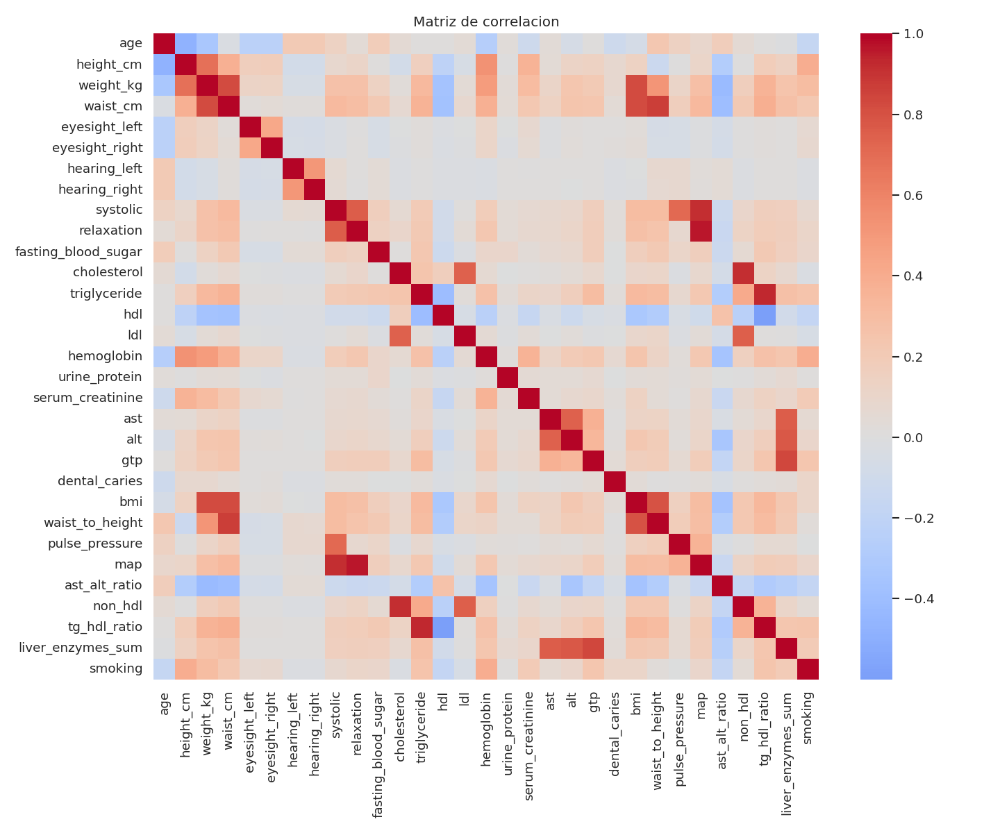
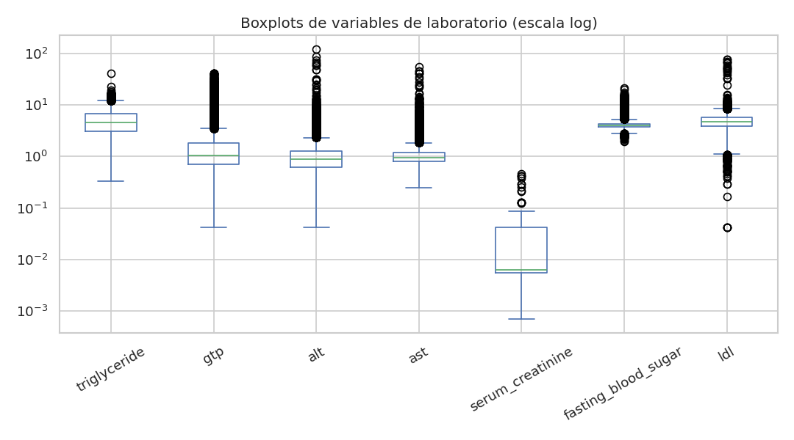
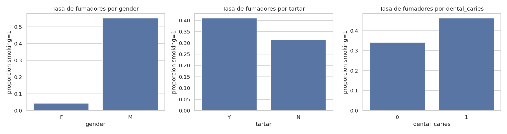
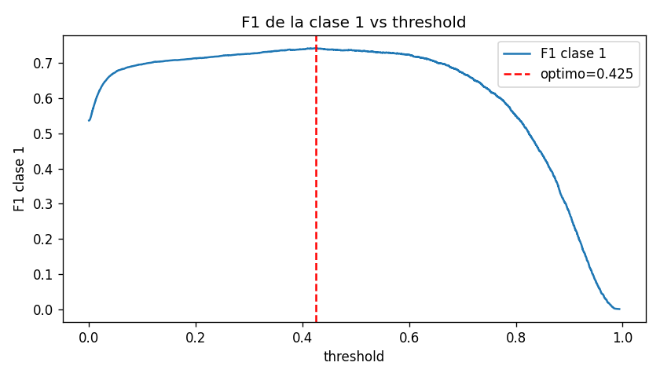
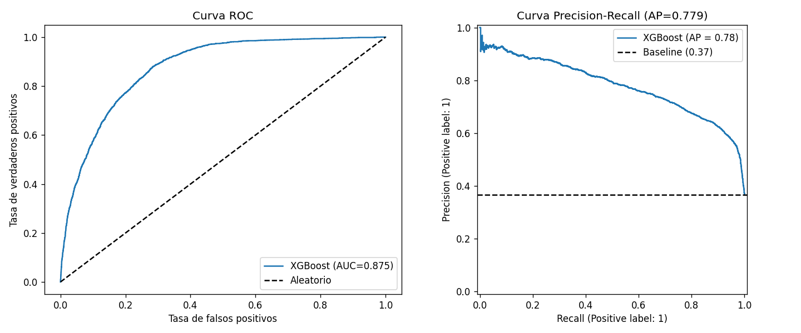
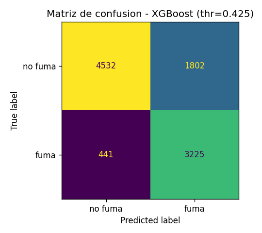
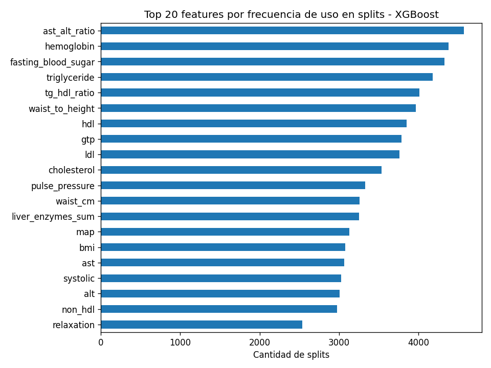

<!-- _class: cover -->
<!-- _paginate: false -->

# Prediccion de fumadores
## a partir de datos biometricos y de laboratorio

Analisis sobre ~50.000 personas evaluadas en un panel de salud

Marcelo Vieira  |  Diplomatura en Inteligencia Artificial

---

<!-- _class: section -->
<!-- _paginate: false -->

01

# El problema y los datos

---

<!-- _class: content -->

# El problema

## Que tenemos que predecir

- Si una persona **fuma o no** (`smoking` = 0/1), a partir de variables biometricas y de un panel de laboratorio.
- 50.000 personas etiquetadas para entrenar, 5.692 sin etiqueta para predecir.

## Como se mide el exito

- **F1-Score de la clase 1** (fumadores), no accuracy.
- El target esta desbalanceado (63% no fuma / 37% fuma): un modelo que dijera siempre "no fuma" tendria 63% de accuracy pero seria inutil.

---

<!-- _class: content -->

# Los datos

## Dos archivos

- **Etiquetado**: 50.000 filas, 27 columnas, para entrenar y validar.
- **Sin etiquetar**: 5.692 filas, para la prediccion final.

## Variables

Demograficas, antropometria, presion arterial, panel de laboratorio (colesterol, trigliceridos, enzimas hepaticas) y salud dental.

## Lo que encontramos al revisar

- El Excel trae ~200 filas vacias al final -> se eliminan.
- `oral` vale siempre "Y" -> no aporta nada, se descarta.
- `hearing_left` / `hearing_right` casi no varian.
- No hay nulos en ninguno de los dos archivos.

---

<!-- _class: section -->
<!-- _paginate: false -->

02

# Analisis exploratorio

---

<!-- _class: content -->

# Que variables se relacionan con fumar?

## Lo que encontramos

Las variables mas correlacionadas con `smoking` son `hemoglobin`, `gtp`, `triglyceride`, `height_cm` y `gender`.

## Por que tiene sentido

Son marcadores hepaticos y metabolicos que se alteran con el habito de fumar, mas la diferencia de habito entre hombres y mujeres en este dataset.

---

<!-- _class: content -->

# Las variables de laboratorio tienen valores extremos

## Lo que encontramos

`triglyceride`, `gtp`, `alt` y `ast` tienen colas largas: la mayoria de las personas tiene valores bajos, pero hay un grupo con valores muy altos.

## Que decidimos hacer

No eliminamos esas filas. No seria replicable en el dataset de prediccion, y el modelo que elegimos (XGBoost) tolera bien este tipo de distribucion.

---

<!-- _class: content -->

# gender y tartar tambien marcan diferencia

## Lo que encontramos

La proporcion de fumadores varia bastante segun `gender` y, en menor medida, segun `tartar` (sarro dental).

## Que podemos hacer

Estas variables categoricas se incorporan al modelo con one-hot encoding, sin perder esta señal.

---

<!-- _class: section -->
<!-- _paginate: false -->

03

# Preparacion de los datos

---

<!-- _class: content -->

# Limpieza y transformacion

## Decisiones de limpieza

- Sacamos `id` (identificador) y `oral` (constante).
- Renombramos columnas a snake_case.
- Imputamos faltantes con mediana (numericas) y moda (categoricas), calculado solo con datos de entrenamiento.

## Por que de esta forma

Todo el ajuste vive dentro de un `Pipeline` de scikit-learn que se entrena exclusivamente con el set de entrenamiento. Asi la validacion y la prediccion final no contaminan ningun calculo.

---

<!-- _class: content -->

# Variables nuevas con sentido biomedico

| Variable | Calculo |
|---|---|
| `bmi` | peso / altura² |
| `waist_to_height` | cintura / altura |
| `pulse_pressure` | sistolica - diastolica |
| `map` | presion arterial media |

| Variable | Calculo |
|---|---|
| `ast_alt_ratio` | indice de De Ritis |
| `non_hdl` | colesterol - hdl |
| `tg_hdl_ratio` | trigliceridos / hdl |
| `liver_enzymes_sum` | ast + alt + gtp |

Se calculan fila por fila, sin usar estadisticos globales: no generan ninguna filtracion de informacion entre conjuntos.

---

<!-- _class: section -->
<!-- _paginate: false -->

04

# Modelos y resultados

---

<!-- _class: content -->

# Comparamos tres modelos

| Modelo | F1 clase 1 (CV) |
|---|---|
| **XGBoost** | **0.7301** |
| Regresion Logistica | 0.7058 |
| Arbol de Decision | 0.7018 |

## Por que elegimos XGBoost

- Mejor F1 en validacion cruzada y en el hold-out.
- Tolera bien los valores extremos del panel de laboratorio.
- No necesita que las variables esten en la misma escala.
- El desbalance se compensa con `scale_pos_weight`.

---

<!-- _class: content -->

# Ajustamos el umbral de decision

## Lo que encontramos

Con threshold 0.50 el F1 es 0.7348. Bajando a **0.4248** sube a **0.742**.

## Por que pasa esto

Con clases desbalanceadas, 0.5 rara vez es el punto optimo. Bajar el umbral hace que el modelo detecte mas fumadores (mas recall), que es justo lo que premia el F1 de clase 1.

---

<!-- _class: content -->

# Que tan bien distingue el modelo

## Lo que encontramos

ROC-AUC = 0.875: muy por encima del azar. PR-AUC = 0.779, muy por encima del baseline (0.37, la proporcion de fumadores).

## Que podemos hacer

Con esta capacidad de ranking, el modelo distingue bien fumadores de no fumadores en todo el rango de thresholds, no solo en el que elegimos.

---

<!-- _class: content -->

# Matriz de confusion final

## Metricas con threshold 0.4248

- F1 clase 1: **0.742**
- Precision clase 1: 0.6415
- Recall clase 1: 0.8797
- Accuracy: 0.7757

## Lectura

El modelo detecta casi 9 de cada 10 fumadores reales, a costa de algunas falsas alarmas. Es la decision correcta para maximizar F1.

---

<!-- _class: content -->

# Que variables usa mas el modelo

## Lo que encontramos

`ast_alt_ratio` (una variable que creamos) es la mas usada, seguida de `hemoglobin`, `fasting_blood_sugar` y `triglyceride`.

## Por que es interesante

Varias de las features que creamos (`ast_alt_ratio`, `tg_hdl_ratio`, `waist_to_height`) quedaron entre las mas usadas: el feature engineering aporto señal real, no solo redundancia.

---

<!-- _class: section -->
<!-- _paginate: false -->

05

# Conclusiones

---

<!-- _class: content -->

# Conclusiones y proximos pasos

## Que logramos

- F1 de clase 1 = **0.742** en validacion, con ROC-AUC de 0.875.
- Pipeline completo serializado: aplicar el modelo a datos nuevos no requiere reentrenar nada.
- Decisiones de preprocesamiento documentadas y sin riesgo de filtracion de datos.

## Limitaciones y mejoras posibles

- El threshold se ajusto sobre el mismo set de validacion (resultado algo optimista).
- Las variables de laboratorio no estan en unidades clinicas reales.
- Se podria probar LightGBM, calibracion de probabilidades, o una busqueda de hiperparametros mas amplia.

---

<!-- _class: closing -->
<!-- _paginate: false -->

# Gracias

¿Preguntas?

Marcelo Vieira  |  TP2 — Prediccion de fumadores (smoking)  |  Diplomatura en IA

